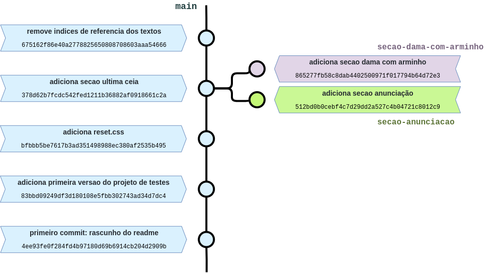

# Quem tem medo de _rebase_? Entre outras histórias.

Este repositório traz algumas dicas úteis e alguns conceitos para você utilizar Git em seu dia a dia, e serve como roteiro para minha talk, de mesmo nome, para meu time de web (_alô gent_).

## Prefácio

Não tenha medo do Git e não tenha medo de errar. Ele é seu amigo e pode te ajudar no dia a dia, além de ajudar outros desenvolvedores a entenderem seu código.

Começaremos a olhar um projeto muito simples (_sim, é feito de lorems_), e adicionaremos algumas funcionalidades a ele, eventualmente nos deparando com alguns problemas do dia a dia, como conflitos.  
Também faremos _rebases_, deletaremos branches e _commits_ por acidente, cometeremos alguns erros, precisaremos de _commits_ que ainda não chegaram à main... Resumindo, tudo o que nós vivemos no dia a dia, né? Temos muito a cobrir, então let's start!

<br>

## Capítulo I: A iniciação

### O que é o Git? Por que precisamos dele?

### Preparando o terreno

Configure suas credenciais, com nome e email:

```bash
$ git config --global user.name "Da Vinci"
$ git config --global user.email da.vinci@renaissance.com
```

Configure também seu editor padrão (_recomendo vi ou vim, para sair dele utilize o comando_ `:quit`)

```bash
$ git config --global core.editor vim
```

Por fim, clone um projeto para começar a trabalhar. Ou inicie um projeto git através do comando `git init`.

## Capítulo II: Trabalhando em equipe

Este capítulo apresenta a branch principal, `main`, refletindo o trabalho de uma equipe qualquer.  
Ela possui alguns _commits_ que configuram o projeto, porém, a partir de um certo ponto, novas _branches_ de trabalho foram criadas a partir dela.

O diagrama abaixo apresenta este momento do projeto:


### Mantendo seu trabalho atualizado

#### Um conto sobre _Merge_

<!-- mostrar a diferenca entre as duas árvores -->

#### Quem tem medo de _Rebase_?

#### Quando o trabalho conflita

<!-- falar sobre push force -->

#### O temido `-f`

#### Bônus: `--onto` o quê?

### Colhendo cerejas :cherries:

## Capitulo III: Manipulando a história?

### Querido diário `reflog`

### `amend`

### `squash`
