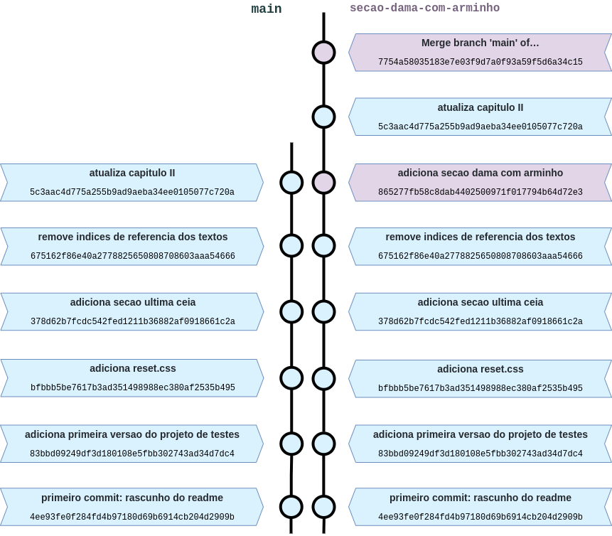

# Quem tem medo de _rebase_? Entre outras histórias.

Este repositório traz algumas dicas úteis e alguns conceitos para você utilizar Git em seu dia a dia, e serve como roteiro para minha _talk_, de mesmo nome, para meu time de _web_.

<!-- falar do nivel intermediario  -->
<!-- falar das branches que estao preparadas para serem baixadas e testadas de acordo com o avanço dos exemplos do texto -->

## Prefácio

Não tenha medo do Git e não tenha medo de errar. Ele é seu amigo e pode te ajudar no dia a dia, além de ajudar outros desenvolvedores a entenderem seu código.

Começaremos a olhar um projeto muito simples (_sim, gênios do renascimento pq não?_), e adicionaremos algumas funcionalidades a ele, eventualmente nos deparando com alguns problemas do dia a dia, como conflitos.  
Também faremos _rebases_, deletaremos _branches_ e _commits_ por acidente, cometeremos alguns erros, precisaremos de _commits_ que ainda não chegaram à `main`...  
Resumindo, tudo o que nós vivemos no dia a dia, né? Temos muito a cobrir, então let's start!

<br>

## Capítulo I: A iniciação

### O que é o Git? Por que precisamos dele?

### Preparando o terreno

Configure suas credenciais, com nome e email:

```bash
$ git config --global user.name "Da Vinci"
$ git config --global user.email da.vinci@renaissance.com
```

Configure também seu editor padrão (_recomendo vi ou vim, para sair dele utilize o comando_ `:quit`)

```bash
$ git config --global core.editor vim
```

Por fim, clone um projeto para começar a trabalhar. Ou inicie um projeto git através do comando `git init`.

## Capítulo II: Trabalhando em equipe

Este capítulo apresenta a branch principal, `main`, refletindo o trabalho de uma equipe qualquer.  
Ela possui alguns _commits_ que configuram o projeto, porém, a partir de um certo ponto, novas _branches_ de trabalho foram criadas a partir dela.

O diagrama abaixo apresenta este momento do projeto:


### Mantendo seu trabalho atualizado

#### Um conto sobre _Merge_

De acordo com a [documentação oficial](https://git-scm.com/docs/git-merge/pt_BR), o _merge_ "une dois ou mais históricos de desenvolvimento".

**Vejamos o seguinte exemplo para entendermos `git merge` de uma vez por todas.**

Supondo que o dev que esteja trabalhando na _branch_ `secao-dama-com-arminho` tenha finalizado sua _feature_ e agora deseje atualizar sua _branch_ com a `main`, afinal a _branch_ principal de trabalho desta equipe continuou avançando.

Então, para atualizar a _branch_, é utilizado o comando `git pull origin main`. Seu editor configurado no Capítulo I então aparecerá com a seguinte mensagem pré definida:

```bash
Merge branch 'main' of github.com:MarianaPicolo/git-everyday-basics into secao-dama-com-arminho
```

Salve e saia do editor.

> Se você configurou vi ou vim, pode salvar o arquivo e sair utilizando o comando `:wq`.

Por fim, o Git exibirá a seguinte mensagem:

```bash
From github.com:MarianaPicolo/git-everyday-basics
 * branch            main       -> FETCH_HEAD
Auto-merging project/index.html
Merge made by the 'recursive' strategy.
 README.md          |   6 +++++-
 project/index.html |  10 +++++-----
 starting.png       | Bin 0 -> 102669 bytes
 3 files changed, 10 insertions(+), 6 deletions(-)
 create mode 100644 starting.png
```

Não tivemos conflitos, e agora a _branch_ `secao-dama-com-arminho` está atualizada em relação a `main`, resultando na seguinte árvore de _commits_:



Perceba que as _hashes_ dos _commits_ que estavam na `main` permaneceram como antes do _merge (balões em azul)_, mas o _commit_ que insere a nova _feature_([_adiciona secao dama com arminho_](https://github.com/MarianaPicolo/git-guia-de-sobrevivencia/commit/865277fb58c8dab4402500971f017794b64d72e3)) ficou **entre** dois _commits_ que estavam previamente na `main`.

Isso acontece porque o `git merge` preserva a árvore de _commits_.......

#### Quem tem medo de _Rebase_?

#### Quando o trabalho conflita

<!-- falar sobre push force -->

#### O temido `-f`

#### Bônus: `--onto` o quê?

### Colhendo cerejas :cherries:

## Capitulo III: Manipulando a história?

### Querido diário `reflog`

### `amend`

### `squash`
